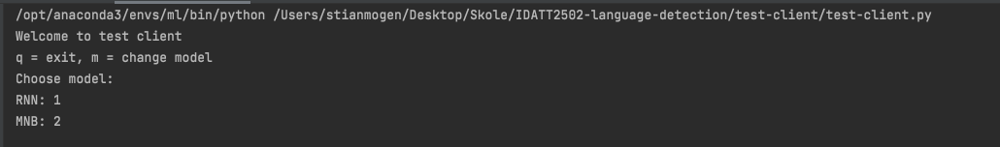

# IDATT2502-language-detection
 
This repository is for the final project in the course IDATT2502-Machine-Learning.

Cloning the repository can be done with the following commands: 
```angular2html
git clone https://github.com/stianmogen/IDATT2502-language-detection.git
git clone git@github.com:stianmogen/IDATT2502-language-detection.git
```
### Running the project

To run the project and test the model, please run, ```test-client.py``` which is located in the test-client directory.

Firstly we can choose the model category



The the specific model type


You can write a sentence among the 235 included languages
The top 3 predictions will be given as output. Here, English (eng) is the top prediction!


Luckily, this specific model is better at Spanish than us. 


Classifying between nordic languages can be a challenge, but here we can see it is still quite doable with the models provided.


#### Running Test-client on CPU
The project uses Cuda, if you are running computations on CPU, you can add 
``
 map_location=torch.device('cpu')
``
in "test-client" at line 59:
```angular2html
model.load_state_dict(torch.load(f"{rnn_out_root}{direction_folder}/{type}/{hidden_size}/model.pth"))
model.load_state_dict(torch.load(f"{rnn_out_root}{direction_folder}/{type}/{hidden_size}/model.pth,  map_location=torch.device('cpu')"))
```

### Project Structure

The project contains the following directories:

- mnb
- rnn
- test-client
- utils
- input
- docs

### MNB (Multinomial Naive Bayes) 

The MNB model is trained in the file named mnb-test-py. By running this you can create the models with your preffered n-grams. (Note, the models become several gigabytes large for n >= 3. If you want to test these yourself, they have to be created locally). This can be done by running ```mnb-train.py```. 

The models are stored in the "out" directory. When running the model, each new model and belonging vectorized, will get its own directory corresponding to the n-values and analyzer.

### RNN (Reccurent Neural Network) 

This directory stored the RNN models, LSTM and GRU. 
- The RNN-model is trained in ```rnn-train```, which uses the rnn-model class for creating the GRU and LSTM models. 
- The dictionary class is used for RNN models in training and prediciton
- The results from these models are stored in the "out" directory, and with their corresponding model-type, direction and hidden-size value.
Additionally a plot with the accuracy and loss for the given model will also be stored here.  

### Test-Client

A ```test-client``` lets the user load their preffered model in the command line. When it is loaded, the user may write a sentence for prediciton.
The currently loaded model will then predict the language of the sentence. 

### Utils 

The utils directory contains necessary classes for the models in the project.
- Batch Generator: Loads data in batches to ensure limitation of memory usage when training.
- Split Dataset: Splits the training, validation and test-data into by users preffered ration.
- Dataloader: Loads the dataset for usage in models, here you can choose specific languages for testing purposes.
- Model Validator: Validates the accuracy of the model.
- Confusion: Provides the bigges amount of mistakes when predicting, for use in cunfusion matrices. 

### Input

The input directory contains the original dataset with the corresponding urls and labels. The dataset is the "WiLI-2018, and was provided [here](https://zenodo.org/record/841984#.YZ-Hvr3MIq0).

The dataset used by the models are saved in the "dataset" directory. The dataset split into the preffered training, validation and test ratio is saved in files ending with "split.txt".

### Docs

Here you can find the project report, or the results from each epoch of each model.
